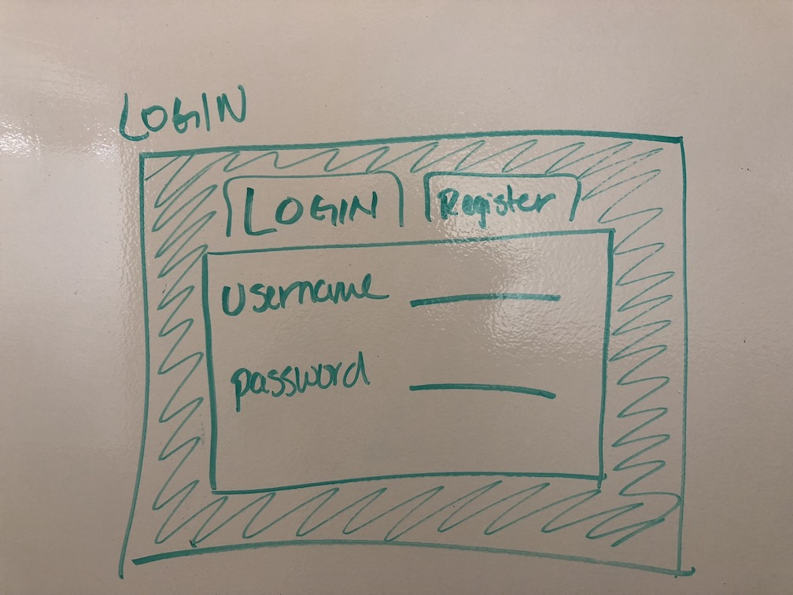
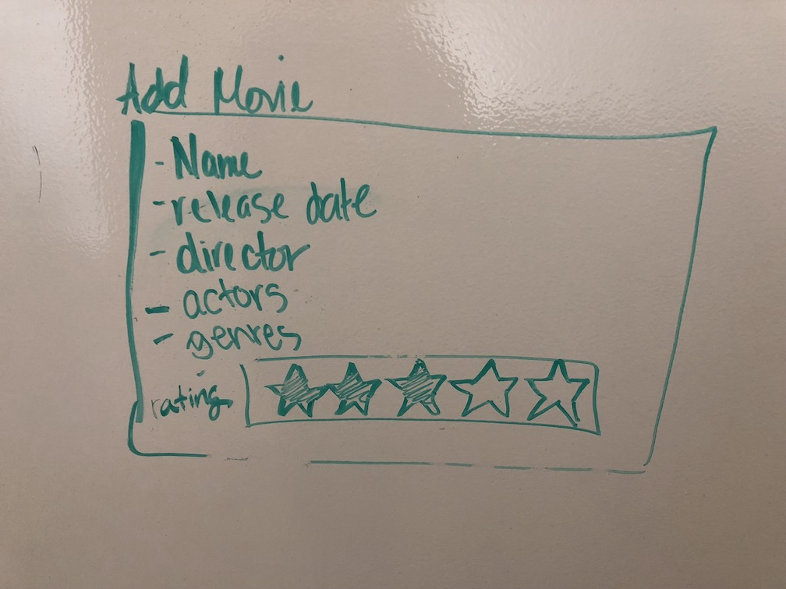
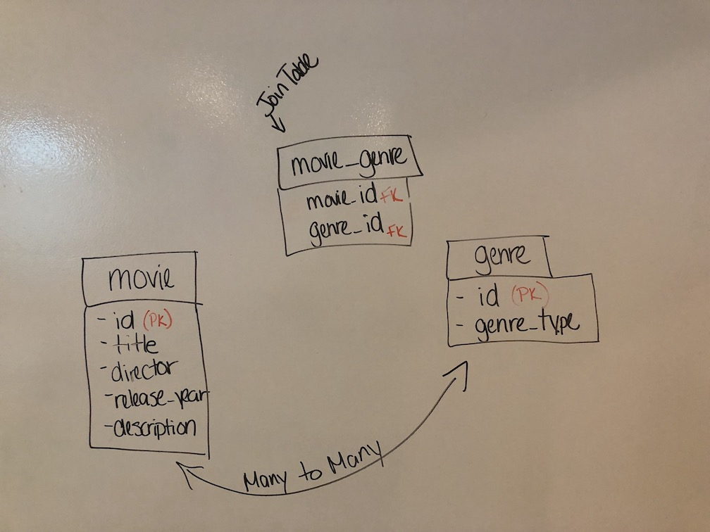

#AKA MovieMinder AKA FilmFile AKA this name is a WIP  
  
##IDEA  
I watch a ton of movies - good, bad... I really don't descriminate.  And many times I have found myself starting a movie, only to get 20 minutes into it and realize I have definitely seen this movie before. So here is where this app comes in.  
  
##OVERVIEW  
This is an app where a user can make entries on movies they have seen.  The user can view all the movies, can edit previous entries or delete an entire entry (you know, maybe if they decide they no longer want people to know how much they enjoyed Twilight) They can also see a list of movies by Genre or see all all Genres. 
  
##PAGES - WIREFRAMES  
Login/Register  
  
See all your movies 
     
Submit a new movie 
    
Update/Delete movie  
  
  
##TABLES  
-I used 3 tables for my database - a MOVIE table, a GENRE table and a join table MOVIE_GENRE because a movie can have many genres and a genre can have many movies.    

  
  
Tables with data in PSQL:
  
  
  

  
##EXCITING CODE  
-Since I need to access more than one table (in order to assign generic movie info and at least one genre) all in one database query, I took the opportunity to dig into PG-PROMISE more and explore 'Transactions' and 'Tasks'. Turns out PG-Promise Tasks was exactly what I needed.  In the model below I was able to insert into the movie table, return the Serial generated id and use that along with the genre id I was sending, to populate the Join table - which would then reference the Genre table.  

  
  
-And I used it again to update entries.  

  
-I also did some digging into SQL and learned that as long as your tables are linked with REFERENCE (or FOREIGN) KEYS that you can delete from 2 tables in one query.  

##MVP
-Use of API to auto-populate forms:  Currently a user cannot assign an image URL so any new movies that are added to the db won't have awesome movie posters.  

-Authenticating a user and saving a session: My hope is to verify a user and allow them to store their personal movie database and have access to see a "friend's" personal database.   

-Make this thing pretty: It is not lost on my that this whole site needs some serious CSS love.  But currently it works and its not Times New Roman (and it is responsive when used on a mobile phone)  
  
##TECHNOLOGIES
Javascript, Node, Express, EJS and SQL 
  
The Movie DB API [https://www.themoviedb.org/documentation/api]  
  

